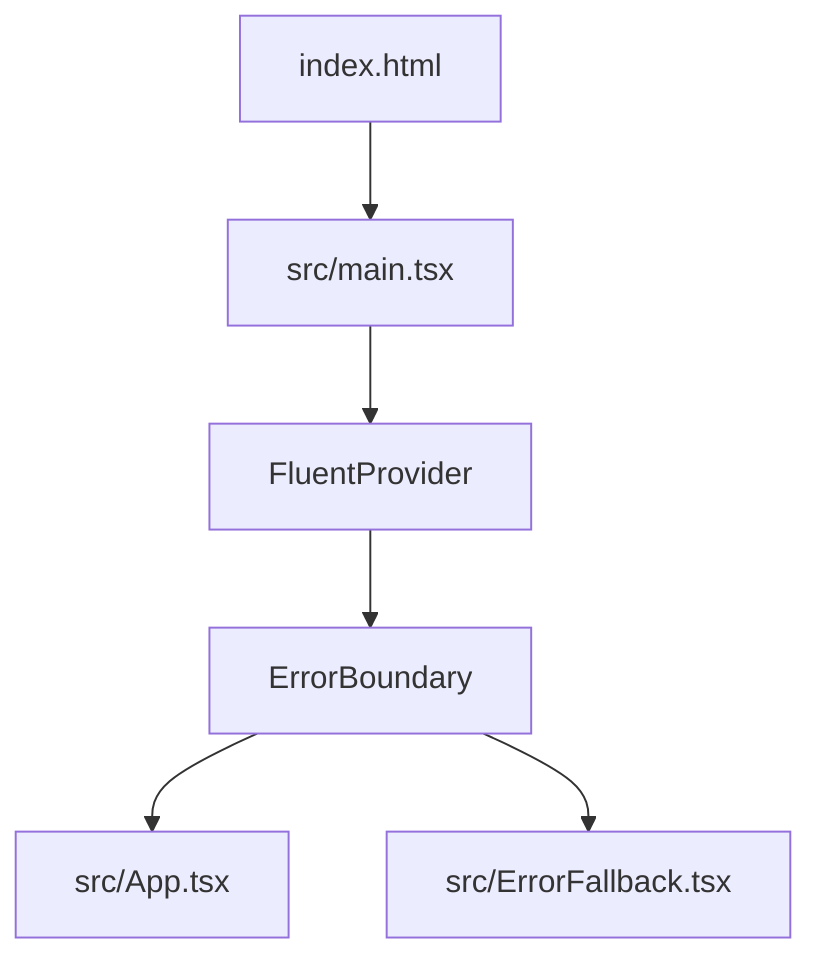

# Architecture

## Overview
The app is a minimal client-side React SPA bootstrapped with Vite. Fluent UI provides presentation primitives. Spark runtime/plugin integration is preserved.

## Folder structure (current)
- `src/main.tsx`: App bootstrap, Fluent provider, error boundary wiring.
- `src/App.tsx`: Primary app shell view.
- `src/ErrorFallback.tsx`: Production runtime error UI.
- `src/index.css`: Minimal global document/root styling.
- `vite.config.ts`: React plugin + Spark plugins.

## Runtime flow


## Build/tooling flow
```mermaid
flowchart LR
  A[npm run dev/build] --> B[Vite]
  B --> C[@vitejs/plugin-react-swc]
  B --> D[@github/spark plugins]
  C --> E[React bundle]
  D --> E
```

## Architectural principles
- Keep baseline lean: only ship dependencies that are actively used.
- Feature-first additions: add libraries only with concrete feature implementation.
- Preserve Spark integration while decoupling from unused scaffold UI systems.
