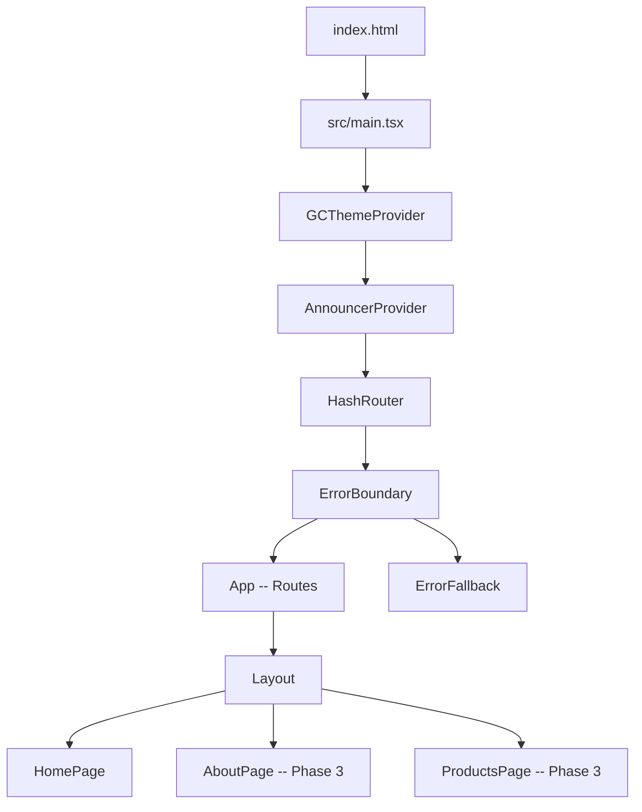

# Architecture

> **Updated**: 2026-02-24 22:38 ET (Phase 2 complete)

## Position in the EVA Ecosystem

```
+-------------------------------------------------------------+
|             31-eva-faces  (monorepo shell)                   |
|  +--------------+  +--------------+  +------------------+   |
|  |  admin-face  |  |  chat-face   |  | accelerator-face |   |
|  | (10 screens) |  |  <- 44-eva-  |  |  <- 46-accel-    |   |
|  |  212 tests   |  |   jp-spark   |  |   ator [Phase 3] |   |
|  +--------------+  +------+-------+  +--------+---------+   |
+----------------------------|--------------------|------------+
                             |                    |
              +--------------v--------------------v---------+
              |        33-eva-brain-v2                       |
              |  :8001 brain-api  |  :8002 roles-api         |
              |  RAG  Chat  Ingest  RBAC  Sessions            |
              +---------------------------------------------------+

+----------------------------------------------+
|  45-aicoe-page  (THIS REPO -- standalone SPA) |
|  Public landing page -- NO Brain API calls    |
|  /         HomePage  hero + tool cards        |
|  /about    [Phase 3]                          |
|  /products [Phase 3]                          |
+----------------------------------------------+
```

## Provider stack (main.tsx)

```
React.StrictMode
  GCThemeProvider          (@eva/gc-design-system -- GC Fluent tokens)
    AnnouncerProvider      (aria-live polite -- WCAG screen reader)
      HashRouter           (react-router-dom)
        ErrorBoundary      (react-error-boundary)
          App              (Routes)
            Layout         (skip-link, header, nav, main outlet, footer)
              HomePage / AboutPage / ProductsPage
```

## Folder structure

```
src/
  main.tsx                   App bootstrap + provider stack
  App.tsx                    HashRouter Routes
  ErrorFallback.tsx          Fluent-based error boundary UI
  theme.ts                   GC token doc (no code -- GCThemeProvider owns it)
  index.css                  Minimal global reset
  components/
    Announcement/
      AnnouncerProvider.tsx  aria-live region + AnnouncerContext
  hooks/
    useAnnouncer.ts          consume AnnouncerContext
  i18n/
    i18n.tsx                 i18next init + languagedetector + lang sync
    locales/
      en/resources_en.json   English strings
      fr/resources_fr.json   French strings
  pages/
    layout/
      Layout.tsx             Skip-link + header + nav + outlet + footer
    home/
      HomePage.tsx           Hero + tool cards + about section
    about/                   [Phase 3]
    products/                [Phase 3]
evidence/                    EVA Veritas story evidence files
```

## Runtime flow



## Build/tooling flow

```mermaid
flowchart LR
  A[npm run build] --> TS[tsc --noEmit]
  A --> VB[vite build]
  VB --> C[@vitejs/plugin-react-swc]
  C --> E[dist/ React bundle]
```

## Architectural principles

- **GC token system** -- All colours and spacing via `tokens.*` from Fluent v9. Never hardcode hex/px.
- **Every string translated** -- No raw English/French in JSX; all strings via `t("key")` from i18n locales.
- **Accessible first** -- Skip-link, `AnnouncerProvider`, `aria-live`, focus management on route change.
- **No Brain API on public page** -- 45 is a public-facing SPA; authentication and Brain endpoints belong in 31-eva-faces faces.
- **Feature-first deps** -- Re-introduce libraries only when tied to a shipped feature.

